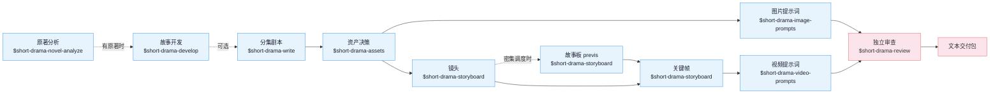

**中文** | [English](README_EN.md)

# Drama Skills

[](https://github.com/worldwonderer/drama-skills/actions/workflows/ci.yml)
[](https://github.com/worldwonderer/drama-skills/releases/latest)
[](https://www.python.org/)
[](LICENSE)

面向编剧、漫剧工作室和编导的 AI 短剧创作工作流。九个技能把一个点子或一部长篇材料，
一路做成分集剧本、资产设定、图片提示词、分镜关键帧、视频提示词和独立审查记录，
全程用同一套创作者决策、来源引用与连续性契约衔接。适配 Claude Code、Codex 和其他
支持 Agent Skill 规范的运行环境。

产出是文本：剧本、设定、提示词、审查记录。

## 由来

这套技能来自我们自己的漫剧工作室产线：2025 年至今累计上千个 AI 短剧 / 漫剧项目，
中间换过几轮自建和开源工具。前后端加起来近 8 万行代码，在模型能力和需求的迭代速度
面前逐渐维护不动了。

后来干脆抛开自建的一体化图形工具，把历史项目工程和图片 / 视频提示词蒸馏成这套技能，
让制作人直接用 agent CLI 加文件维护工程、生成提示词，确认之后再送去生成——结果意外地顺手。
现在留在自建工具里的，只剩排队抽卡。

**刻意不含生图与生视频**：为防止未经确认的提示词误触发生成、造成预算浪费，本项目
不调用真正的图片、视频或音频生成服务。提示词先落进文件、由人确认，再进入生成环节。

## 安装

需要 **Python 3.10 或更新版本**（macOS 自带的 3.9 不够）。直接告诉 Claude Code、
Codex 等支持导入 GitHub 仓库的智能体：

```
安装这些技能 https://github.com/worldwonderer/drama-skills
```

<details>
<summary>手动链接（九个技能目录必须保持同级）</summary>

```bash
git clone https://github.com/worldwonderer/drama-skills.git && cd drama-skills

# Claude Code
mkdir -p "$HOME/.claude/skills"
for skill in skills/*; do
  ln -s "$PWD/$skill" "$HOME/.claude/skills/$(basename "$skill")"
done

# Codex
mkdir -p "${CODEX_HOME:-$HOME/.codex}/skills"
for skill in skills/*; do
  ln -s "$PWD/$skill" "${CODEX_HOME:-$HOME/.codex}/skills/$(basename "$skill")"
done
```

已存在同名技能时先移除旧链接，不要混装版本。

</details>

调用写法随运行环境而变：Claude Code 用 `/short-drama`，Codex 用 `$short-drama`，
也可以不写前缀、直接用自然语言说明要做什么。两种写法在下文示例中可以互换。

## 快速开始

```
# 0. 有原著时（可选）：先抽样快评，再决定要不要全量拆
用 $short-drama-novel-analyze 快评 输入/这本小说.txt，先告诉我值不值得拆

# 已有多集完整剧本时（可选）：按文件实际结构索引，每次只读当前集，断点续做分集地图
用 $short-drama-develop 从 输入/剧本完整版.txt 生成分集地图；先识别这份文件的分集方式，不要整稿塞进上下文

# 1. 新建项目
用 $short-drama 初始化一个都市打脸题材的短剧项目，竖屏 9:16

# 2. 写第一集
用 $short-drama-write 写第 1 集：外卖员在高档餐厅被经理羞辱，亮出集团董事身份

# 3. 拆资产、分镜、视频提示词：主干就这三句
用 $short-drama-assets 从第 1 集拆人物/场景/道具
用 $short-drama-storyboard 给第 1 集拆镜头和关键帧
用 $short-drama-video-prompts 把分镜逐镜翻译成视频提示词

# 3a. 与分镜平行的分支，不必等镜头拆完
用 $short-drama-image-prompts 为已接受的资产写参考图提示词

# 3b. 可选，不需要就别发
用 $short-drama 做 Look Development，再由 $short-drama-image-prompts 写人物/地点/高压力风格帧提示词
用 $short-drama-storyboard 给第 1 集的关键场次比较导演方案、接受场次视觉计划
用 $short-drama-storyboard 给第 1 集第 1 场出场次故事板 previs sheet（在镜头与关键帧之间；密集调度或动作戏才值得，简单场次直接进关键帧）

# 4. 独立审查
用 $short-drama-review 审查第 1 集的剧本与提示词
```

第 3 步只有三句是必经的。参考图提示词与分镜是资产接受之后的**平行兄弟**——分镜不等参考图，
参考图也不等镜头；Look Development 与故事板 previs 是分支，不需要时不发那一句。检查点全图见
[创作者流程](skills/short-drama/references/creator-workflow.md#checkpoints-and-branches)。

一集完整的摘录链条见 [demo/](demo/)：剧本 → 资产设定 → 分镜 → 视频提示词。

## 九个技能



| 技能 | 职责 |
|---|---|
| `short-drama` | 初始化、路由、视觉方向/Look Development、状态、接受/审查生命周期与交付 |
| `short-drama-novel-analyze` | 长篇原著的抽样改编快评、章节索引、逐章功能提取、剧情单元与节奏、改编价值与分集候选 |
| `short-drama-develop` | 小说/长材料的可追溯改编、多集整稿的 Agent 主导切片与续跑、故事引擎、分集地图、导演阐述、题材与钩子手册 |
| `short-drama-write` | 单集目标、因果节拍、可拍剧本和项目选择的制作稿格式 |
| `short-drama-assets` | 人物/造型、地点/视图、道具/状态、可选的角色声音方向与连续性决策 |
| `short-drama-image-prompts` | Lookdev 风格帧、角色/场景/道具参考板提示词与定点修改说明 |
| `short-drama-storyboard` | 可选场次视觉计划与 Coverage Audition、原文落实、镜头、边界、可选故事板 previs sheet 和冻结关键帧 |
| `short-drama-video-prompts` | 单镜动作、多人物表演与注意交接、摄影、声音、起止状态与补拍说明 |
| `short-drama-review` | 结构/内容审查、授权生产观察的项目级校准诊断与独立结论 |

`$short-drama` 是入口路由，负责初始化、继续、恢复和交付，把具体工作转给对应技能。
现成单集剧本可以直接进入规范化或资产拆解；多集整稿需要生成分集地图时，由开发技能按
文件实际结构建立一次索引、逐集切片并断点续跑；点子从故事开发进入。手上是一部长篇原著时，
先走 `$short-drama-novel-analyze` 抽样快评，值得拆再拆出分析层与分集候选，
再由故事开发把它立成改编契约。

三条单帧提示词路径职责不同：项目级 `lookdev_frame` 检验已接受视觉方向；资产提示词固定人物、
地点、道具的可复用事实；`storyboard` 的关键帧只投影本镜 start（执行方式需要时可增加只投影
`end_boundary` 的 end 帧）。三者都只交付文本，不调用图片模型。

关键场次可以在正式 shots 前增加一层稀疏导演决策：先比较真正不同的信息时机、观看位置与
表演空间，再接受场次视觉计划，让构图、空间、摄影和声音共同完成一个转向。普通场景跳过，
不规定宫格、方案数或镜头数。

## 演示

《孤身入魔》演示含项目设定、两集剧本和十二板分镜；下方 15 秒宣传样片为临时展示，非默认产物。

https://github.com/user-attachments/assets/ae88b444-06e5-4964-856c-91e619020f12

## 本地短剧创作台

在智能体里一句话启动（Codex 写作 `$short-drama dashboard`）：

```
/short-drama dashboard
```

创作台目前仅支持 macOS/Linux；Windows 支持套件安装与命令行生命周期工具，
但创作台因安全目录描述符要求会拒绝启动。


## 致谢

[LINUX DO - The New Ideal Community](https://linux.do) — 社区支持
