[中文](README.md) | **English**

# Drama Skills

[](https://github.com/worldwonderer/drama-skills/actions/workflows/ci.yml)
[](https://github.com/worldwonderer/drama-skills/releases/latest)
[](https://www.python.org/)
[](LICENSE)

An AI short-drama creation suite for screenwriters, motion-comic studios, and
directors. Nine skills take an idea or a long-form source all the way to episode
scripts, asset decisions, image prompts, storyboard keyframes, video prompts, and
independent review records — carrying creator decisions, source evidence, and
continuity through the entire chain. Works with Claude Code, Codex, and other
runtimes that support Agent Skills.

The output is text: scripts, asset notes, prompts, review records.

## Where this came from

These skills come out of our own motion-comic studio's production line: over a
thousand AI short-drama and motion-comic projects since 2025, across several
generations of in-house and open-source tooling. Front end and back end together
reached nearly 80,000 lines, and stopped being maintainable at the pace models and
requirements were moving.

The answer turned out to be dropping the monolithic all-in-one GUI — distilling
the historical project workspaces and image/video prompts into this skill suite, and letting
producers maintain projects and write prompts directly through an agent CLI over
plain files, confirming the prompts before anything goes to generation. It works
noticeably better. What is left of the in-house tooling is the generation queue.

**Image and video generation are deliberately out of scope:** to prevent unreviewed
prompts from accidentally triggering paid generation and wasting budget, the suite
does not call image, video, or audio generation services. Prompts land in files,
receive human confirmation, and only then move to generation.

## Install

Needs **Python 3.10 or newer** (the 3.9 that ships with macOS is not enough).
Just tell Claude Code, Codex, or any agent that can import a GitHub repository:

```
Install this skill suite: https://github.com/worldwonderer/drama-skills
```

<details>
<summary>Manual linking (the nine directories must stay siblings)</summary>

```bash
git clone https://github.com/worldwonderer/drama-skills.git && cd drama-skills

# Claude Code
mkdir -p "$HOME/.claude/skills"
for skill in skills/*; do
  ln -s "$PWD/$skill" "$HOME/.claude/skills/$(basename "$skill")"
done

# Codex
mkdir -p "${CODEX_HOME:-$HOME/.codex}/skills"
for skill in skills/*; do
  ln -s "$PWD/$skill" "${CODEX_HOME:-$HOME/.codex}/skills/$(basename "$skill")"
done
```

Remove any same-named skill links first — do not mix versions.

</details>

Invocation differs by runtime: Claude Code uses `/short-drama`, Codex uses
`$short-drama`, and you can always drop the prefix and just describe the task in
plain language. The two forms are interchangeable in the examples below.

## Quick start

```
# 0. With a source novel (optional): triage before committing to a full pass
Use $short-drama-novel-analyze to triage 输入/novel.txt and tell me whether it is worth adapting

# With a complete multi-episode script (optional): infer this file's boundaries,
# read one episode at a time, and resume the episode map from disk
Use $short-drama-develop to build the episode map from 输入/full-screenplay.txt without loading the whole season into context

# 1. New project
Use $short-drama to init a vertical 9:16 urban face-slapping short-drama project

# 2. Write episode 1
Use $short-drama-write to write EP001: a delivery rider humiliated at a luxury
hotel turns out to be the group chairman

# 3. Extract assets, write prompts and storyboards
Use $short-drama-assets to extract characters/scenes/props from EP001
When the visual language needs alignment, use $short-drama for Look Development,
then $short-drama-image-prompts for character/location/high-pressure style-frame prompts
Use $short-drama-image-prompts to write reference prompts for accepted assets
Use $short-drama-storyboard to audition distinct directing approaches for key scenes,
accept a scene visual plan, then author the shots
Use $short-drama-storyboard for a previs storyboard sheet of EP001 SC001 (worth it for
dense blocking or action; skip it for simple scenes)
Use $short-drama-storyboard to project each panel into a keyframe first frame
Use $short-drama-video-prompts to translate each authored shot into a video prompt

# 4. Independent review
Use $short-drama-review to review EP001's script and prompts
```

See [demo/](demo/) for one episode's full excerpt chain: script → asset sheets →
storyboard → video prompts.

## The nine skills

```mermaid
flowchart LR
    classDef phase fill:#e8f4fd,color:#1a1a2e,stroke:#4a9be8,stroke-width:1px
    classDef final fill:#fce4ec,color:#333,stroke:#e57373,stroke-width:1px

    nva["Source analysis<br/>$short-drama-novel-analyze"]:::phase
    dev["Story development<br/>$short-drama-develop"]:::phase
    write["Episode script<br/>$short-drama-write"]:::phase
    assets["Asset decisions<br/>$short-drama-assets"]:::phase
    img["Image prompts<br/>$short-drama-image-prompts"]:::phase
    sb["Shots<br/>$short-drama-storyboard"]:::phase
    sheet["Previs sheet<br/>$short-drama-storyboard"]:::phase
    kf["Keyframes<br/>$short-drama-storyboard"]:::phase
    vid["Video prompts<br/>$short-drama-video-prompts"]:::phase
    rev["Independent review<br/>$short-drama-review"]:::final
    pkg["Text delivery package"]:::final

    nva -.with a source.-> dev
    dev -.optional.-> write --> assets
    assets --> img
    assets --> sb
    sb -.dense blocking.-> sheet --> kf
    sb --> kf --> vid
    img --> rev
    vid --> rev --> pkg
```



| Skill | Responsibility |
|---|---|
| `short-drama` | Init, routing, visual direction/Look Development, state, acceptance/review lifecycle, delivery |
| `short-drama-novel-analyze` | Sampled adaptation triage, chapter index, per-chapter function extraction, story units and rhythm, adaptation value, and episode candidates for a long source |
| `short-drama-develop` | Traceable adaptation, Agent-led indexing/slicing/resume for complete multi-episode scripts, story engine, episode map, director brief, genre & hook playbook |
| `short-drama-write` | Episode contract, causal beats, performable screenplay, and the project's accepted production dialect |
| `short-drama-assets` | Character/Look, Location/View, Prop/State, optional voice direction, continuity decisions |
| `short-drama-image-prompts` | Lookdev style frames, reusable character/location/prop reference prompts, and scoped edits |
| `short-drama-storyboard` | Optional scene visual plans and Coverage Auditions, source coverage, shots, boundaries, an optional previs storyboard sheet, and frozen keyframes |
| `short-drama-video-prompts` | Ordered action, multi-actor performance and attention handoffs, camera/audio intent, timing, and exact boundaries |
| `short-drama-review` | Structural/content review, project-bounded diagnosis from authorized production observations, and independent verdicts |

`$short-drama` is the entry router: it initializes, resumes, recovers, and delivers
projects, dispatching the actual work to the matching skill. An existing single-episode
screenplay can enter normalization or asset extraction directly. When a complete
multi-episode script needs an episode map, development indexes its actual structure once,
reads one verified slice at a time, and resumes from the on-disk map. An idea or long-form
source enters through story development.

The three single-frame prompt paths have distinct ownership: project-level
`lookdev_frame` prompts test an accepted visual direction; asset prompts preserve
reusable character/location/prop facts; and `storyboard` keyframes project a shot's
start state (plus an end-boundary frame only when the external workflow requires it).
All three deliver text only and call no media model.

Key scenes may add a sparse directing layer before formal shots: compare genuinely
different information timing, audience position, and performance ownership, then
accept a scene visual plan that aligns composition, space, camera, and sound around
one dramatic turn. Ordinary scenes skip it; there is no fixed grid, option count, or
shot-count formula.

## Demo

*Lone Fall into Demonhood* includes project settings, two scripts, and twelve storyboard
panels; the 15-second promo below is a temporary showcase, not a default suite artifact.

https://github.com/user-attachments/assets/ae88b444-06e5-4964-856c-91e619020f12

## Local creator workspace

One line inside your agent (Codex writes `$short-drama dashboard`):

```
/short-drama dashboard
```

The workspace runs locally on macOS/Linux. It uses one page: a plain content list on
the left and an always-visible document on the right. Opening a project loads its
screenplay immediately; there are no page tabs or pop-up document viewers. Tasks and
export stay as compact notes below the document, while paths and workflow internals
remain system-owned.


